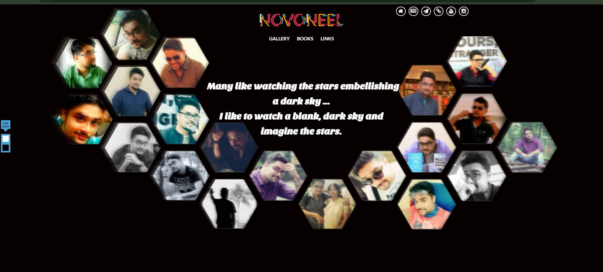
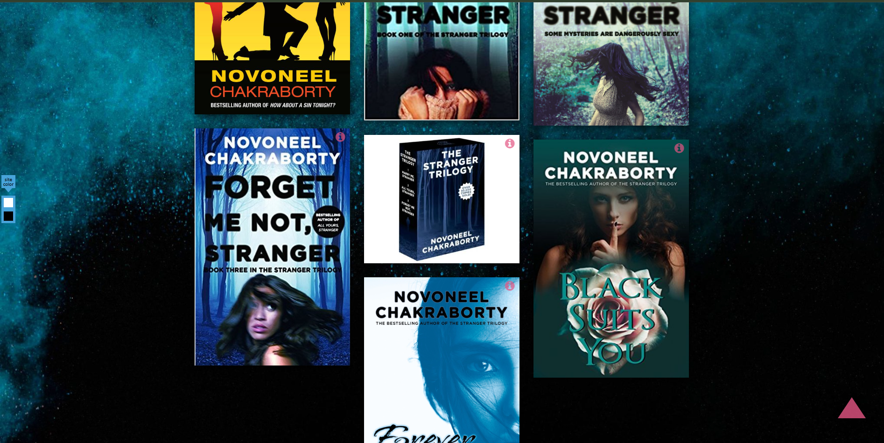
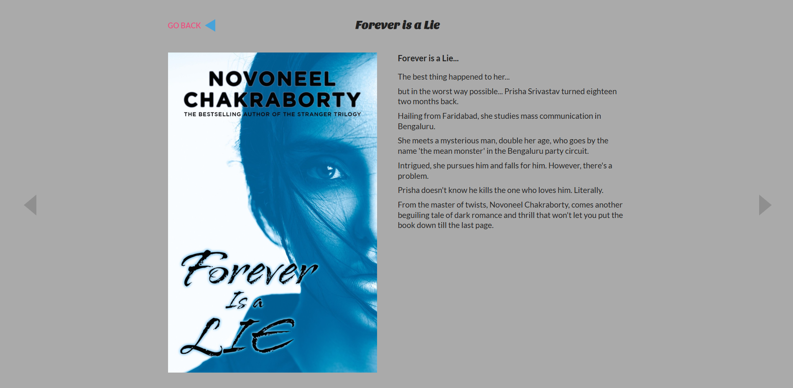
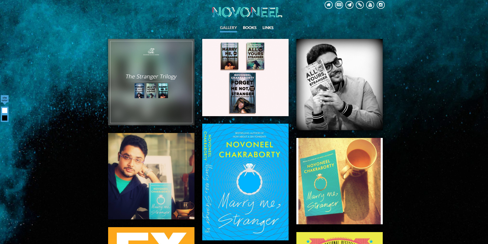
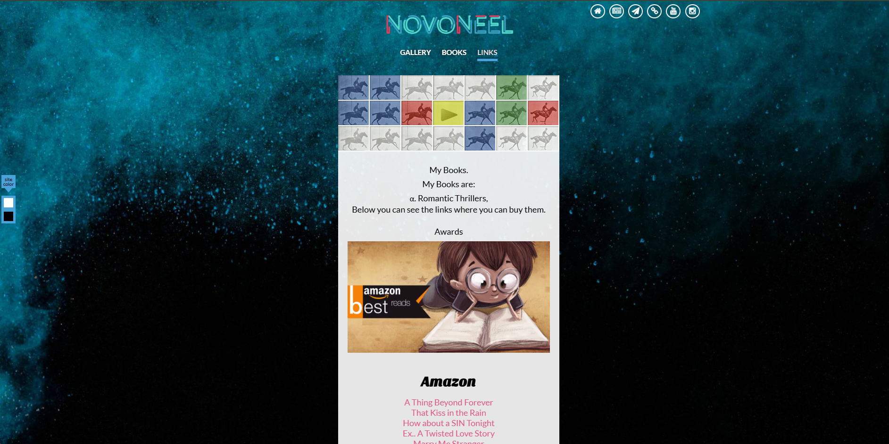

# Novoneel Chakraborty Portfolio

This is a simple static website created out of personal interest, dedicated to showcasing the works of Indian author **Novoneel Chakraborty**. The website provides details about his books, career, and other relevant information in a portfolio-style format.

## 🌐 Live Demo
The website is deployed on **GitHub Pages**. You can check it out here: [Live Demo](https://tan-nandam.github.io/author-portfolio/)

---

## 📸 Screenshots

### Home Page


### Books Section


### Book Information


### About Novoneel


### Useful Links


---

## 🏗️ Technologies Used
- **HTML5** - Structure of the website
- **CSS3** - Styling and layout
- **JavaScript** - Interactive elements
- **External CSS & JS Files** - Organized styles and scripts separately

---

## 📁 Project Structure
```
📦 author-Portfolio
 ┣ 📂 content
 ┃ ┣ 📜 ....
 ┣ 📂 html
 ┃ ┣ 📜 aboutme.html
 ┃ ┣ 📜 books.html
 ┃ ┣ 📜 ....
 ┣ 📂 css
 ┃ ┣ 📜 css.css
 ┃ ┣ 📜 morecss.css
 ┣ 📂 js
 ┃ ┣ 📜 imagesloaded.pkgd.min.js
 ┃ ┣ 📜 jquery.colorbox-min.js
 ┃ ┣ 📜 js.js
 ┃ ┣ 📜 masonry.pkgd.min.js
 ┃ ┣ 📜 morejs.js
 ┃ ┣ 📜 tiltfx.js
 ┣ 📂 images
 ┃ ┣ 📜 p1.png
 ┃ ┣ 📜 p3.png
 ┃ ┣ 📜 ....
 ┣ 📜 index.html
 ┣ 📜 README.md
```

---

## 🚀 How to Run Locally
1. **Clone the Repository**
   ```bash
   git clone https://github.com/tan-nandam/author-portfolio.git
   ```
2. **Navigate to the Project Directory**
   ```bash
   cd author-portfolio
   ```
3. **Open `index.html` in your Browser**
   Simply open `index.html` in any browser (Chrome, Firefox, Edge, etc.)

---

## 📜 License
This project is for educational and personal use only. No commercial use intended.

---

### ⭐ Show Some Love
If you liked this project, don't forget to **star the repository** ⭐ on GitHub!

---

### 📬 Contact
For any suggestions or queries, feel free to contact me via [GitHub Issues](https://github.com/tan-nandam/author-portfolio/issues) or email.

---

Enjoy exploring **Novoneel Chakraborty’s** world of books! 📖✨
